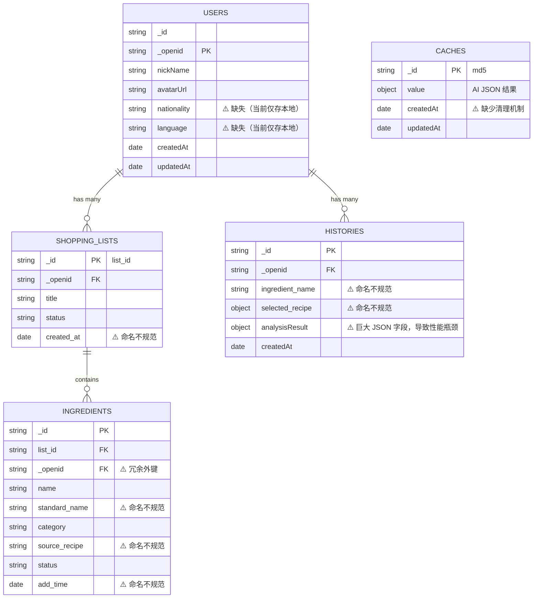
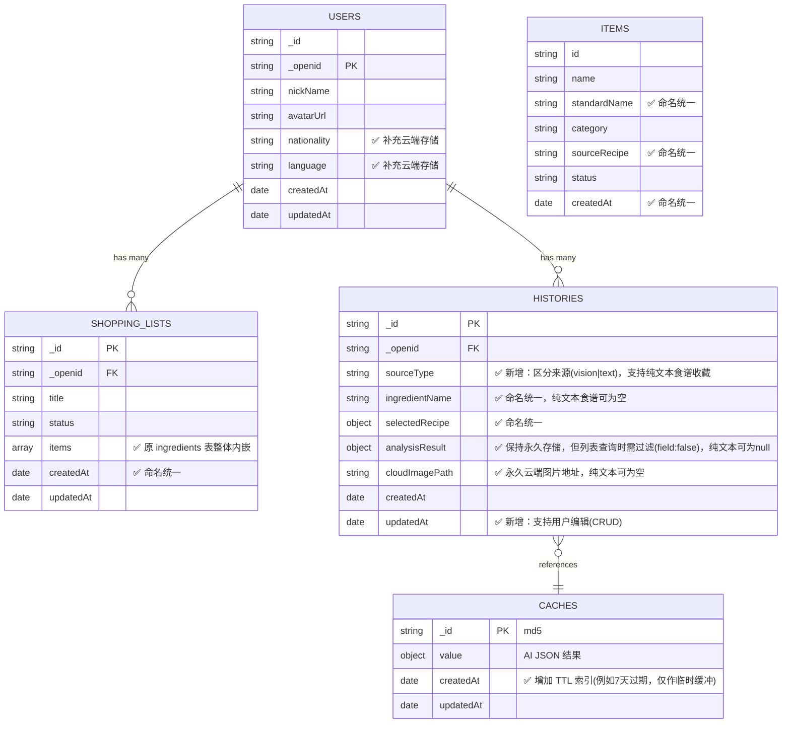

# 识为鲜 PinFresh - 数据库结构规整与优化计划书

## 1. 背景与目标
在 MVP 阶段，当前的数据库结构覆盖了核心业务流程，但随着项目的推进，暴露出了读写性能、字段命名规范、存储成本等方面的不合理问题。为了提升小程序响应速度、降低云开发成本并统一前后端代码规范，特制定此数据库结构优化计划。

**核心目标：**
- **性能优化**：减少数据库请求次数，提升页面加载速度（特别是购物清单列表）。
- **成本控制**：建立缓存淘汰机制（TTL），避免历史记录带来的带宽及存储浪费。
- **规范统一**：全局统一字段命名风格（小驼峰 `camelCase`），减少前后端联调的心智负担。
- **数据一致性**：利用 NoSQL 的文档内嵌特性，解决级联删除导致的“孤儿数据”问题。

## 2. 数据结构对比与可视化

### 2.1 现有数据结构 (MVP 阶段)

目前的数据结构中，购物清单和食材是分离的两张表，存在冗余字段和较大的关联查询开销。同时字段命名存在下划线与驼峰混用的情况。



### 2.2 改进后的数据结构 (V2 阶段)

优化后的结构利用了 NoSQL 的内嵌特性，将 `ingredients` 合并入 `shopping_lists`。同时统一了 `camelCase` 命名规范，剥离了历史记录中的大字段，并引入了缓存清理机制。



### 2.6 支持文本/语音食谱的集邮收藏
- **现状**：用户通过文本或语音直接输入菜谱时，解析结果仅存入当天的 `shopping_lists` 中，不被记录到 `histories`（集邮册）里。
- **改造**：为 `histories` 表新增 `sourceType` 字段（区分 `vision` 和 `text`）。当用户通过文本/语音输入明确的菜谱名时，不仅写入购物清单，同时写入一条 `sourceType: 'text'` 的记录到集邮册。此时允许 `ingredientName`（主食材）、`cloudImagePath` 和 `analysisResult` 为空。

### 2.7 前后端联动：补齐高级 CRUD 与批量操作交互
- **现状**：目前的 UI 交互仅支持单条删除（左滑/长按）和全表清空，缺乏精细化的管理能力（如重命名、多选批量删除）。
- **改造**：借助此次数据结构扁平化（内嵌数组）的契机，在前端视图层（特别是“我的”页面的集邮册、食谱库、历史账单）同步引入“编辑模式”。支持 Checkbox 多选批量删除，以及点击标题触发的 Rename 交互，后端提供对应的 `db.command.in` 批量删除及 `update` 接口支撑。

---

## 3. 核心改造点设计

### 2.1 集合合并：购物清单与食材表内嵌化
- **现状**：`shopping_lists` 和 `ingredients` 是两张独立的表（1:N 关系），读取一个清单需发起两次请求，删除清单易产生冗余的食材数据。
- **改造**：废弃独立的 `ingredients` 表，将食材列表作为数组（`items`）内嵌到 `shopping_lists` 集合中。单次查询即可获取完整清单，删除清单天然完成级联删除。

### 2.2 字段命名规范化
- **现状**：时间字段混用 `createdAt` / `created_at` / `add_time`；用户外键混用 `_openid` / `user_id` / `userId`。
- **改造**：
  - 统一时间字段命名为 `createdAt` 和 `updatedAt`。
  - 统一用户关联外键为微信云开发默认的 `_openid`（对于跨端情况可保留 `userId`，但需全局统一）。

### 2.3 历史记录（集邮册）大字段按需加载
- **现状**：`histories` 表作为永久知识库，存储了完整的 `analysisResult`（包含所有 AI 识别结果），但在列表渲染时全量拉取带来了极大的网络带宽与内存压力。
- **改造**：由于“集邮”定位为永久知识库且允许用户 CRUD，因此**不将完整数据移至缓存表**，依然保留在 `histories` 中。但强制要求小程序端在查询“集邮列表”时，必须使用 `.field({ analysisResult: false })` 过滤掉该巨大字段，仅在点击进入详情页时通过 ID 单条拉取完整内容。

### 2.4 引入 AI 缓存临时缓冲池（TTL）
- **现状**：`caches` 表缺乏清理机制，存储成本随时间只增不减。
- **改造**：由于历史记录已永久保存了必要的分析结果，`caches` 表的定位退化为“识别过程中的短时防抖缓冲”。为其设置较短的 TTL 索引（例如 7 天过期），自动回收临时 AI JSON。

### 2.5 用户配置云端同步
- **现状**：用户的国籍（`nationality`）和语言偏好（`language`）目前仅存储在小程序的本地缓存（Storage）中，一旦用户更换设备或清理缓存，配置将丢失。
- **改造**：将 `nationality` 和 `language` 补充到 `users` 集合的 Schema 中。在用户登录、选择国籍或切换语言时，触发云端更新，实现配置的跨设备同步。

---

## 3. 目标数据结构字典 (Schema)

### 3.1 `users` (用户信息表)
```json
{
  "_id": "user_id_xxx",
  "_openid": "wx_openid_xxx",  // 统一主键/外键
  "nickName": "微信用户",
  "avatarUrl": "https://...",
  "nationality": "cn",         // 变更：新增，记录国家/地区
  "language": "zh",            // 变更：新增，记录语言偏好
  "createdAt": "ServerDate",
  "updatedAt": "ServerDate"
}
```

### 3.2 `shopping_lists` (购物清单表) - **核心变更**
```json
{
  "_id": "list_id_xxx",
  "_openid": "wx_openid_xxx",
  "title": "24-04-04 采购清单",
  "status": "active", // active | completed
  "items": [          // 变更：将原 ingredients 表内嵌至此
    {
      "id": "item_id_xxx",
      "name": "土豆",
      "standardName": "土豆",     // 驼峰命名
      "category": "蔬菜豆制品",
      "sourceRecipe": "酸辣土豆丝", // 驼峰命名
      "status": "pending",      // pending | bought
      "createdAt": "ServerDate"
    }
  ],
  "createdAt": "ServerDate",
  "updatedAt": "ServerDate"
}
```

### 3.3 `histories` (识别历史/集邮表 - 永久知识库)
```json
{
  "_id": "history_id_xxx",
  "_openid": "wx_openid_xxx",
  "sourceType": "vision",           // 新增：区分来源(vision|text)
  "ingredientName": "青椒",         // 驼峰命名，用户可编辑（纯文本输入可为空）
  "selectedRecipe": {
    "recipeName": "青椒肉丝",       // 驼峰命名，用户可编辑
    "ingredientsNeeded": [...]
  },
  "analysisResult": { ... },        // 变更：永久保留该完整 JSON 以支持回看与修改（纯文本输入可为null）
  "cloudImagePath": "cloud://...",  // 永久云端图片地址（纯文本输入可为空）
  "createdAt": "ServerDate",
  "updatedAt": "ServerDate"         // 新增：支持 CRUD 更新时间
}
```

### 3.4 `caches` (AI 临时缓存池)
```json
{
  "_id": "md5_hash_xxx",
  "value": { ... },                 // 完整的 AI 识别 JSON 结果
  "createdAt": "ServerDate",        // 变更：增加 TTL 索引 (例如 7 天过期自动清理)
  "updatedAt": "ServerDate"
}
```

### 3.5 `feedbacks` (用户反馈表)
```json
{
  "_id": "feedback_id_xxx",
  "_openid": "wx_openid_xxx",       // 统一为 _openid
  "content": "反馈内容...",
  "contact": "联系方式",
  "images": ["cloud://..."],
  "status": "pending",
  "createdAt": "ServerDate"
}
```

---

## 4. 影响范围分析

此次数据库结构规整将直接影响以下核心模块的代码逻辑：
1. **云函数**：
   - `cloudfunctions/analyze`: 写入 `caches` 表逻辑（需确保写入 `createdAt` 以配合 TTL）。
   - `cloudfunctions/extractList`: 若有写入 `shopping_lists` 或 `ingredients` 的逻辑需更新为数组内嵌写入。
2. **小程序端**：
   - `miniprogram/utils/db.js`: 所有涉及到 `ingredients`、`shopping_lists` 的增删改查逻辑封装。
   - `miniprogram/pages/list/index`: 购物清单的读取、食材项状态的切换逻辑（改为数组元素的更新操作）。
   - `miniprogram/pages/my/index`: 在“食材集邮册”列表查询时，补充 `.field({ analysisResult: false })` 避免内存溢出；跳转详情时按需拉取单条完整记录。
   - `miniprogram/pages/my/index`: 在更新国籍和获取用户信息时，将 `nationality` 和 `language` 同步至云端 `users` 表。
   - `miniprogram/app.js`: 语言切换时同步更新云端 `users` 表。

---

## 5. 执行计划与迁移步骤

建议分阶段进行平滑升级，避免对现有用户造成数据丢失。

### Phase 1: 环境准备与索引设置
- 在微信云开发控制台，为 `caches` 集合的 `createdAt` 字段添加 TTL 索引。
- 备份当前线上 `shopping_lists`、`ingredients` 和 `histories` 集合数据。

**✅ 验收标准：**
- `caches` 集合在云开发控制台中成功显示 TTL 索引并生效（过期数据被自动清理）。
- 成功导出并妥善保存当前线上所有核心业务集合的 JSON 备份文件。

### Phase 2: 后端数据层与逻辑重构 (Backend & Data Layer)
- **数据层重塑**：修改 `utils/db.js`，将 `shopping_lists` 的查询逻辑改为直接获取 `items`，移除所有对独立 `ingredients` 表的查询。将清单内食材的“购买状态”更新逻辑改为使用 `db.command.set` 或数组更新符。
- **批量接口暴露**：在 `db.js` 中新增支持多选批量删除和内容更新（如重命名 title、更新食材名称）的封装方法。
  - *注意*：由于微信小程序端数据库 API 的安全限制，`where().remove()` 或 `where().update()` 批量操作可能会失败。这里的“批量封装”在底层应实现为：使用 `Promise.all` 包装的并发单条 `doc(id).remove()/update()` 操作，或者新建一个专门的云函数来执行管理员权限的批量操作。
- **清单生成逻辑修复**：修改 `pages/result/index.js` 的 `generateList` 方法，在将辅料（`ingredientsNeeded`）写入购物清单的同时，**必须将主食材（`ingredientName`）也作为一个 item 一并写入**。
- **纯文本集邮支持**：修改 `pages/index/index.js` 中的 `processTextToList` 方法，在解析出明确的菜谱后额外追加一次写入 `histories` 的操作，携带 `sourceType: 'text'`。
- **云函数更新**：更新 AI 识别和文本提取的云函数，确保输出字段满足小驼峰命名规范。

**✅ 验收标准：**
- 新建购物清单时，数据能以 `items` 数组形式正确且完整地写入 `shopping_lists` 集合。
- 纯文本/语音生成的菜谱能正确携带 `sourceType: 'text'` 字段写入 `histories` 表。
- `utils/db.js` 中不存在任何对独立 `ingredients` 表的直接查询和更新调用。

### Phase 3: 前端视图层与交互重构 (Frontend & UI)
- **字段引用更新**：全量检查所有 `.wxml` 和 `.js`，将引用的字段名更新为小驼峰（如 `created_at` -> `createdAt`，`source_recipe` -> `sourceRecipe`）。
- **历史记录性能优化**：在 `pages/my/index` 的集邮列表查询中加上 `.field({ analysisResult: false })` 过滤巨大字段，并在点击时按需单条拉取。
- **用户配置同步**：在 `app.js` 的 `initLanguage` 和 `my/index` 的国籍切换方法中，补充调用 `users` 表的 `update()`，确保本地偏好写入云端。
- **引入高级 CRUD 与多选 UI**：
  - 在 `pages/my/index`（我的厨房）的三个 Tab（集邮册、食谱、历史购物单）中，右上角增加**“编辑”**按钮，点击进入多选模式（展示 Checkbox）。
  - 底部提供**“删除选项”**和**“一键清空”**按钮。
  - 支持点击标题触发重命名弹窗（如修改清单名称或食材名称），联动调用 Phase 2 新增的底层 API。

**✅ 验收标准：**
- 各个页面的数据渲染完全正常，前端控制台无 `undefined` 字段或数据缺失报错。
- “集邮册”与“历史购物单”列表加载速度显著提升，Network 面板验证列表查询时未拉取 `analysisResult` 大字段。
- 用户国籍和语言配置修改后，云端 `users` 表能正确更新，更换设备登录依然生效。
- 在“我的厨房”中能顺畅使用多选删除、清单/食材重命名功能，并且数据在前端和云端正确同步。

### Phase 4: 数据清洗与迁移脚本 (Data Migration)
为确保老用户数据平滑过渡到 V2 架构，需新建并执行一个一次性的临时云函数（如 `dbMigrationV2`）进行数据清洗。
- **任务 A：购物清单内嵌化**：
  - 遍历 `shopping_lists`，通过 `list_id` 查询对应的 `ingredients` 数据。
  - 将食材列表转化为 `items` 数组并执行 `update` 写入 `shopping_lists`。
  - 转换过程中完成字段小驼峰化（如 `standard_name` -> `standardName`），并统一时间戳为 Date 对象。
  - 清理旧字段：使用 `_.remove()` 删除外层的 `created_at`。
- **任务 B：集邮册结构升级**：
  - 遍历 `histories`，将旧字段 `ingredient_name` 改为 `ingredientName`，并使用 `_.remove()` 移除旧字段。
  - 处理嵌套对象：`selected_recipe` 转为 `selectedRecipe`。
  - 补充新字段：为所有旧记录打上 `sourceType: 'vision'` 的标签，并补充 `updatedAt` 时间戳。
- **收尾与销毁**：
  - 脚本执行完毕且线上运行观察无异常后，在云开发控制台手动删除旧的 `ingredients` 集合以及该临时云函数。

**✅ 验收标准：**
- 迁移云函数执行成功且云端日志无报错，旧 `shopping_lists` 数据均成功内嵌正确的 `items` 数组。
- 所有旧的 `histories` 记录完成字段驼峰命名转换，并补充了 `sourceType: 'vision'`。
- 使用老账号登录验证，历史购物清单和集邮记录完整呈现，未出现数据断层或格式错误。

### Phase 5: 测试与上线
- 进行完整的功能回归测试（创建清单、提取清单、勾选食材、删除清单、历史记录查看）。
- 确认无误后发布新版小程序，并在云开发控制台安全删除原 `ingredients` 表。

**✅ 验收标准：**
- 核心流程（拍照识物、语音“记一笔”、生成与编辑清单、历史记录查看与批量管理）在真机与体验版上完成端到端闭环测试。
- 正式版发布后，观察 24 小时内的云开发日志与监控报警，无与数据库结构相关的异常报错。

---

## 6. 补充优化项：宝藏食谱独立解耦 (Phase 6)

### 6.1 背景与痛点
目前“宝藏食谱”是通过前端聚合查询 `shopping_lists` 中的历史记录动态生成的。这种做法导致了“知识库（食谱）”与“交易记录（购物单）”强耦合。如果用户在宝藏食谱中删除某道菜，会导致历史购物单中相应的食材记录也被删除，造成账单数据残缺。

### 6.2 改造目标
将“宝藏食谱”彻底从 `histories` 和 `shopping_lists` 中剥离，建立一个全新且独立的 `recipes` 集合。只有用户主动“收藏”的食谱，才会进入并显示在宝藏食谱中，从而实现数据层的彻底解耦。

### 6.3 目标数据结构字典 (Schema) - 新增
```json
{
  "_id": "recipe_id_xxx",
  "_openid": "wx_openid_xxx",          // 统一外键
  "recipeName": "葱姜炒青蟹",            // 菜谱名称
  "ingredientName": "青蟹",              // 关联的主食材名称
  "ingredientsNeeded": ["葱", "姜", "蒜"], // 配料列表（纯文本数组）
  "sourceType": "familiar",            // 来源类型：familiar | local | text | custom
  "cloudImagePath": "cloud://...",     // 封面图（可选，复用识别时的图片）
  "createdAt": "ServerDate",           // 收藏时间
  "updatedAt": "ServerDate"            // 更新时间
}
```

### 6.4 核心改造点与执行步骤
- **UI 交互引入主动收藏**：在识别结果页（`pages/result/index`）、历史账单详情页和食材集邮详情页中，新增“❤️ 收藏食谱”操作。点击后，将该菜谱信息写入独立的 `recipes` 集合。
- **查询逻辑重构**：修改 `pages/my/index.js`，当切换到“宝藏菜谱” Tab 时，废弃原本针对 `shopping_lists` 的复杂 aggregate 聚合查询，改为直接针对 `recipes` 集合的简单分页查询（`.where({ _openid })`）。
- **删除逻辑解耦**：在宝藏菜谱列表中执行删除操作时，仅调用 `db.collection('recipes').doc(id).remove()`，彻底避免对 `shopping_lists` 的误伤。
- **历史数据平滑迁移脚本**：编写一次性迁移云函数，将老用户通过 `shopping_lists` 聚合出来的历史菜谱，批量提取并写入到新的 `recipes` 集合中，确保用户升级后“宝藏菜谱”数据不丢失。

**✅ 验收标准：**
- 结果页等入口支持“收藏食谱”功能，且数据正确写入 `recipes` 表。
- “宝藏菜谱”列表读取 `recipes` 表数据，渲染正常，加载速度极大提升。
- 删除宝藏食谱中的记录，对应的历史购物清单数据完整无损。
- 迁移脚本执行成功，老用户的宝藏食谱完整迁移至独立集合。