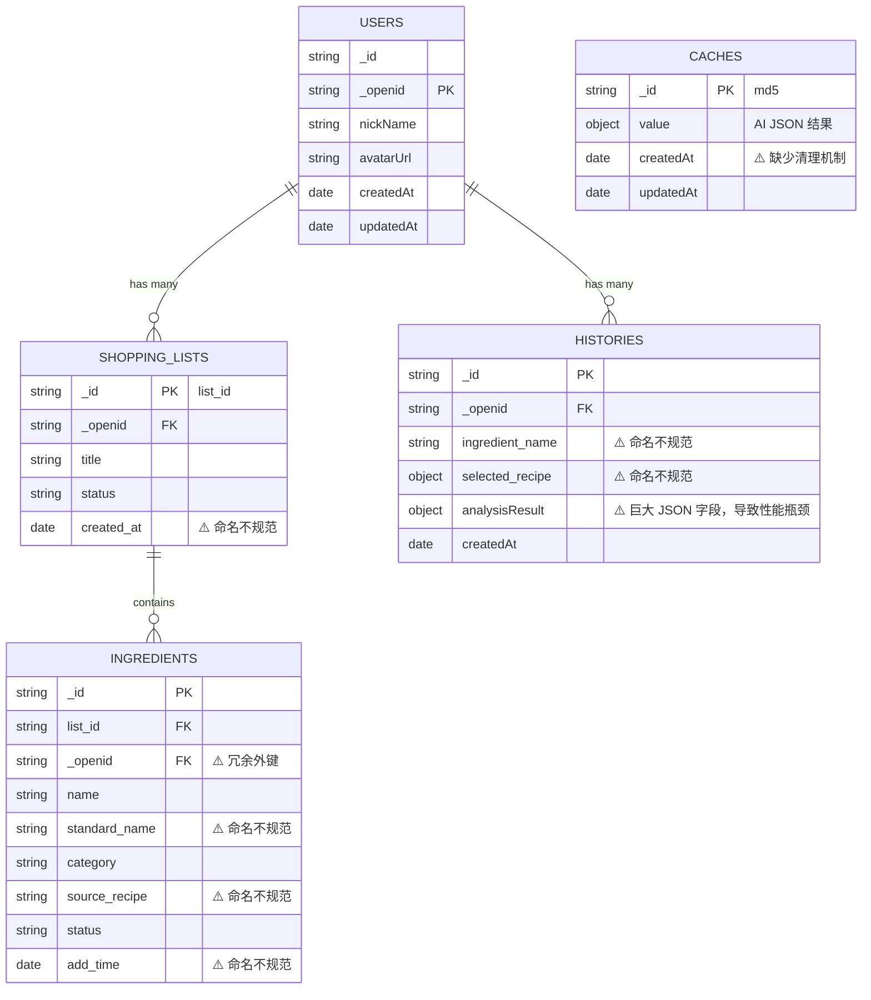
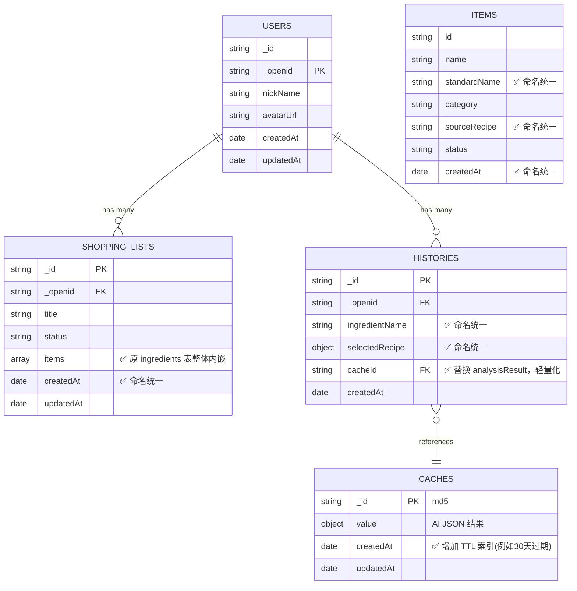

# 识为鲜 PinFresh - 数据库结构规整与优化计划书

## 1. 背景与目标
在 MVP 阶段，当前的数据库结构覆盖了核心业务流程，但随着项目的推进，暴露出了读写性能、字段命名规范、存储成本等方面的不合理问题。为了提升小程序响应速度、降低云开发成本并统一前后端代码规范，特制定此数据库结构优化计划。

**核心目标：**
- **性能优化**：减少数据库请求次数，提升页面加载速度（特别是购物清单列表）。
- **成本控制**：建立缓存淘汰机制（TTL），避免历史记录带来的带宽及存储浪费。
- **规范统一**：全局统一字段命名风格（小驼峰 `camelCase`），减少前后端联调的心智负担。
- **数据一致性**：利用 NoSQL 的文档内嵌特性，解决级联删除导致的“孤儿数据”问题。

## 2. 数据结构对比与可视化

### 2.1 现有数据结构 (MVP 阶段)

目前的数据结构中，购物清单和食材是分离的两张表，存在冗余字段和较大的关联查询开销。同时字段命名存在下划线与驼峰混用的情况。



### 2.2 改进后的数据结构 (V2 阶段)

优化后的结构利用了 NoSQL 的内嵌特性，将 `ingredients` 合并入 `shopping_lists`。同时统一了 `camelCase` 命名规范，剥离了历史记录中的大字段，并引入了缓存清理机制。



---

## 3. 核心改造点设计

### 2.1 集合合并：购物清单与食材表内嵌化
- **现状**：`shopping_lists` 和 `ingredients` 是两张独立的表（1:N 关系），读取一个清单需发起两次请求，删除清单易产生冗余的食材数据。
- **改造**：废弃独立的 `ingredients` 表，将食材列表作为数组（`items`）内嵌到 `shopping_lists` 集合中。单次查询即可获取完整清单，删除清单天然完成级联删除。

### 2.2 字段命名规范化
- **现状**：时间字段混用 `createdAt` / `created_at` / `add_time`；用户外键混用 `_openid` / `user_id` / `userId`。
- **改造**：
  - 统一时间字段命名为 `createdAt` 和 `updatedAt`。
  - 统一用户关联外键为微信云开发默认的 `_openid`（对于跨端情况可保留 `userId`，但需全局统一）。

### 2.3 历史记录大字段剥离
- **现状**：`histories` 表存储了完整的 `analysisResult`，列表渲染时带来极大的网络带宽与内存压力。
- **改造**：`histories` 仅保留概览信息，完整的识别结果通过关联字段（如 `cacheId`）按需从 `caches` 表拉取，或在列表查询时强制过滤大字段。

### 2.4 引入缓存生命周期管理（TTL）
- **现状**：`caches` 表缺乏清理机制，存储成本随时间只增不减。
- **改造**：为 `caches` 表设置基于 `createdAt` 的 TTL 索引（例如 30 天过期），利用云数据库特性自动回收过期缓存数据。

---

## 3. 目标数据结构字典 (Schema)

### 3.1 `users` (用户信息表)
```json
{
  "_id": "user_id_xxx",
  "_openid": "wx_openid_xxx",  // 统一主键/外键
  "nickName": "微信用户",
  "avatarUrl": "https://...",
  "createdAt": "ServerDate",
  "updatedAt": "ServerDate"
}
```

### 3.2 `shopping_lists` (购物清单表) - **核心变更**
```json
{
  "_id": "list_id_xxx",
  "_openid": "wx_openid_xxx",
  "title": "24-04-04 采购清单",
  "status": "active", // active | completed
  "items": [          // 变更：将原 ingredients 表内嵌至此
    {
      "id": "item_id_xxx",
      "name": "土豆",
      "standardName": "土豆",     // 驼峰命名
      "category": "蔬菜豆制品",
      "sourceRecipe": "酸辣土豆丝", // 驼峰命名
      "status": "pending",      // pending | bought
      "createdAt": "ServerDate"
    }
  ],
  "createdAt": "ServerDate",
  "updatedAt": "ServerDate"
}
```

### 3.3 `histories` (识别历史/集邮表)
```json
{
  "_id": "history_id_xxx",
  "_openid": "wx_openid_xxx",
  "ingredientName": "青椒",         // 驼峰命名
  "selectedRecipe": {
    "recipeName": "青椒肉丝",       // 驼峰命名
    "ingredientsNeeded": [...]
  },
  "cacheId": "cache_id_xxx",        // 变更：替代完整的 analysisResult，指向缓存
  "createdAt": "ServerDate"
}
```

### 3.4 `caches` (AI 缓存表)
```json
{
  "_id": "md5_hash_xxx",
  "value": { ... },                 // 完整的 AI 识别 JSON 结果
  "createdAt": "ServerDate",        // 变更：将在此字段设置 TTL 索引 (例如过期时间 30 天)
  "updatedAt": "ServerDate"
}
```

### 3.5 `feedbacks` (用户反馈表)
```json
{
  "_id": "feedback_id_xxx",
  "_openid": "wx_openid_xxx",       // 统一为 _openid
  "content": "反馈内容...",
  "contact": "联系方式",
  "images": ["cloud://..."],
  "status": "pending",
  "createdAt": "ServerDate"
}
```

---

## 4. 影响范围分析

此次数据库结构规整将直接影响以下核心模块的代码逻辑：
1. **云函数**：
   - `cloudfunctions/analyze`: 写入 `caches` 表逻辑（需确保写入 `createdAt` 以配合 TTL）。
   - `cloudfunctions/extractList`: 若有写入 `shopping_lists` 或 `ingredients` 的逻辑需更新为数组内嵌写入。
2. **小程序端**：
   - `miniprogram/utils/db.js`: 所有涉及到 `ingredients`、`shopping_lists` 的增删改查逻辑封装。
   - `miniprogram/pages/list/index`: 购物清单的读取、食材项状态的切换逻辑（改为数组元素的更新操作）。
   - `miniprogram/pages/result/index`: 保存历史记录时，去除完整的 `analysisResult` 写入，改为关联 `cacheId`。

---

## 5. 执行计划与迁移步骤

建议分阶段进行平滑升级，避免对现有用户造成数据丢失。

### Phase 1: 环境准备与索引设置
- 在微信云开发控制台，为 `caches` 集合的 `createdAt` 字段添加 TTL 索引。
- 备份当前线上 `shopping_lists`、`ingredients` 和 `histories` 集合数据。

### Phase 2: 代码逻辑重构
- **数据层**：修改 `db.js`，将 `shopping_lists` 的查询逻辑改为直接获取 `items`，移除所有对独立 `ingredients` 表的查询。将清单内食材的“购买状态”更新逻辑改为使用 `db.command.set` 或数组更新符。
- **云函数**：更新 AI 识别和文本提取的云函数，确保输出字段满足小驼峰命名规范。
- **历史记录**：修改历史记录的保存与读取逻辑，改为基于 `cacheId` 按需拉取详情。
- **视图层**：全量检查 `.wxml` 和 `.js`，将引用的字段名更新为小驼峰（如 `created_at` -> `createdAt`）。

### Phase 3: 数据清洗与迁移脚本
- 编写并运行云端数据迁移脚本（Data Migration Script）：
  - 遍历所有 `shopping_lists`。
  - 查询对应的 `ingredients` 数据，将其转化为数组并 `update` 写入 `shopping_lists.items`。
  - 遍历 `histories`，清洗掉过大的 `analysisResult`，仅保留轻量引用。

### Phase 4: 测试与上线
- 进行完整的功能回归测试（创建清单、提取清单、勾选食材、删除清单、历史记录查看）。
- 确认无误后发布新版小程序，并在云开发控制台安全删除原 `ingredients` 表。