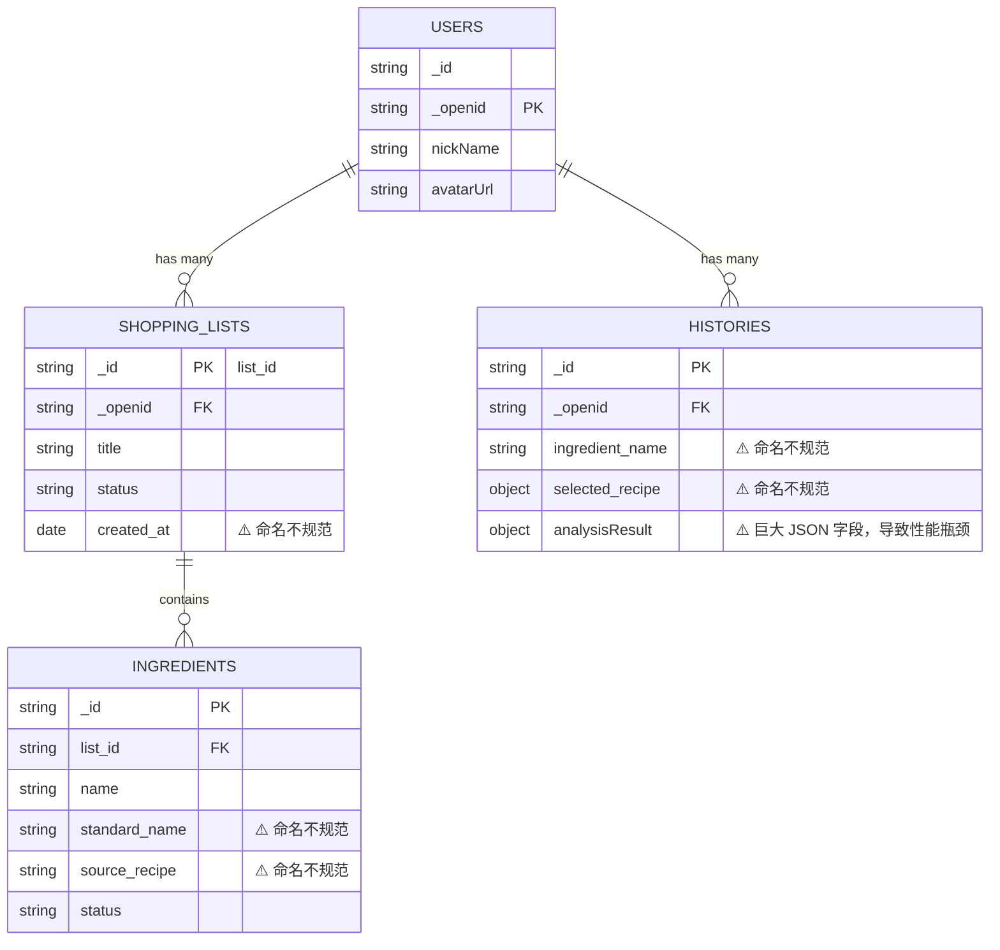
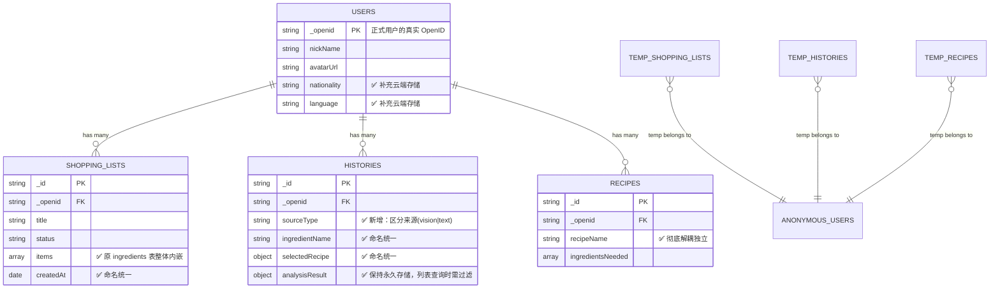

# 识为鲜 PinFresh V2：账号与数据库融合重构计划书 (匿名与正式双轨制)

## 1. 背景与核心目标

在 MVP 阶段，我们暴露出了数据库读写性能不佳、命名规范不统一以及账号登录体验割裂的问题。本计划将原本的两份独立重构计划（`db-restructure-plan.md` 和 `mvp-auth-plan.md`）合二为一，提出一套**“体验至上、无缝升级”**的账号与数据架构方案。

**⚠️ 重要原则（事关全局稳定性）：**
1. **彻底覆盖重写**：必须完全覆盖并重写现有的账号体系（`auth.js`）与数据库封装层（`db.js`），彻底摒弃 `anon_xxx` 这种半吊子的伪匿名逻辑，不留任何技术债。
2. **绝对不与前端业务逻辑冲突**：在底层 `db.js` 进行封装与抹平差异，无论底层怎么分库分表、怎么从多表变成内嵌数组，对外的接口入参与出参格式必须保持一致。保障现有的前端页面交互、业务流转（如相机识物、语音提取、清单展示）**无需大规模调整逻辑**即可正常运作。
3. **全量代码 Review 与冗余清理**：开发完成后，必须邀请高级代码审查专家（如 `code-review-principal` Agent）进行全量代码质量审查，清理所有历史废弃代码与冗余文件，且每一步必须经由用户（User）亲自确认。

**核心目标：**
1. **匿名与正式双轨制**：使用微信官方提供的 `signInAnonymously()`。未登录游客可完整体验识物与临时清单功能；正式注册用户享受长久数据云同步。
2. **数据集合物理隔离**：匿名用户的数据自动路由并写入 `temp_` 前缀的临时数据库集合，正式用户写入正式集合，互不污染。
3. **按需无缝迁移**：仅在游客触发“收藏食谱”、“保存购物记录”等高价值行为时阻断并要求授权登录。授权成功后，触发云端一键迁移，将游客期的临时数据完美转正。
4. **底层结构扁平化**：顺势完成 V2 数据库结构升级，统一采用小驼峰（`camelCase`）命名，废除独立的 `ingredients` 表，将食材作为 `items` 数组内嵌至 `shopping_lists`。

***

## 2. 数据结构演进与可视化

### 2.1 现有数据结构 (MVP 阶段)

目前的数据结构中，购物清单和食材是分离的两张表，存在冗余字段和较大的关联查询开销。且登录态与匿名态耦合在同一套表内，通过自定义的 `anon_xxx` 区分，容易造成数据混乱。



### 2.2 优化后的数据结构 (V2 双轨制阶段)

优化后的结构利用了 NoSQL 的内嵌特性，将 `ingredients` 合并入 `shopping_lists`。统一了 `camelCase` 命名规范，彻底解耦了宝藏食谱，并且引入了官方匿名登录与 `temp_` 临时集合的物理隔离。



***

## 3. 数据结构规范与双轨集合设计

数据库结构保持两套（Schema 完全一致，但通过集合名称隔离）：

### 3.1 集合路由映射表

- 用户表：`users` (暂不需要临时表)
- 购物单：`shopping_lists` / `temp_shopping_lists`
- 历史集邮：`histories` / `temp_histories`
- 宝藏食谱：`recipes` / `temp_recipes`
- AI 缓存：`caches` (共用，依靠 TTL 自动清理)

### 3.2 核心 Schema (双表通用)

**1.** **`shopping_lists`** **/** **`temp_shopping_lists`** (核心变更：内嵌食材)

```json
{
  "_id": "list_id_xxx",
  "_openid": "wx_openid_xxx",       // 匿名或真实 openid
  "title": "24-04-04 采购清单",
  "status": "active", 
  "items": [                        // 变更：原 ingredients 表内嵌至此
    {
      "id": "item_id_xxx",
      "name": "土豆",
      "standardName": "土豆",
      "category": "蔬菜",
      "sourceRecipe": "酸辣土豆丝",
      "status": "pending",
      "createdAt": "ServerDate"
    }
  ],
  "createdAt": "ServerDate",
  "updatedAt": "ServerDate"
}
```

**2.** **`histories`** **/** **`temp_histories`** (集邮册)

```json
{
  "_id": "history_id_xxx",
  "_openid": "wx_openid_xxx",
  "sourceType": "vision",           // vision | text
  "ingredientName": "青椒",
  "selectedRecipe": { "recipeName": "青椒肉丝", "ingredientsNeeded": [...] },
  "analysisResult": { ... },        // 完整JSON，列表查询时需过滤 field({ analysisResult: false })
  "cloudImagePath": "cloud://...",
  "createdAt": "ServerDate",
  "updatedAt": "ServerDate"
}
```

**3.** **`recipes`** **/** **`temp_recipes`** (宝藏食谱：彻底解耦)

```json
{
  "_id": "recipe_id_xxx",
  "_openid": "wx_openid_xxx",
  "recipeName": "葱姜炒青蟹",
  "ingredientName": "青蟹",
  "ingredientsNeeded": ["葱", "姜", "蒜"],
  "sourceType": "vision",
  "cloudImagePath": "cloud://...",
  "createdAt": "ServerDate",
  "updatedAt": "ServerDate"
}
```

***

## 4. 用户旅程与数据库调用分析 (User Journeys)

为了确保双轨制与内嵌结构能够完美支撑所有的业务场景，现穷举并验证当前系统中的核心用户旅程（User Journeys）及其对应的底层数据调用链路：

### 4.1 旅程一：初次启动与无感体验

- **用户行为**：首次打开小程序，不进行任何点击。
- **状态流转**：前端静默调用 `wx.cloud.signInAnonymously()`，获得匿名 OpenID。本地 `pf_auth_source` 标记为 `anonymous`。
- **数据库调用**：不涉及任何业务集合读写。

### 4.2 旅程二：核心识物与生成临时清单

- **用户行为**：点击相机拍照或长按语音输入 -> 识别出食材与推荐菜谱 -> 勾选所需食材 -> 点击“生成购物单”。
- **数据库调用**：
  1. 识别成功后，完整 JSON 写入共用的 `caches` 集合（设定 TTL，7天自动清理）。
  2. 生成清单时，调用 `db.js -> getActiveList()`。根据 `authSource` 自动路由至 `temp_shopping_lists`，若今日无活跃清单，则创建一条新的文档（初始 `items: []`）。
  3. 调用 `db.js -> addIngredientsToList()`，使用 `db.command.push` 将勾选的食材作为对象内嵌到 `temp_shopping_lists` 的 `items` 数组中。

### 4.3 旅程三：清单内的高频交互 (打勾/修改/单删)

- **用户行为**：在“购物单”页面，对某项食材进行打勾标记已买、修改名字，或左滑删除。
- **数据库调用**：
  - **打勾/修改**：调用 `updateIngredientStatus` 或 `updateIngredientName`。在 `temp_shopping_lists` 中获取当前文档，遍历 `items` 数组修改对应元素的字段，然后整数组回写 `update`（由于微信云开发限制了部分数组深层修改操作，整存整取或利用特定指令进行局部更新是可靠方案）。
  - **删除单项食材**：调用 `deleteIngredients`，过滤掉目标 ID 后，将更新后的 `items` 数组回写。

### 4.4 旅程四：高价值行为触发转化 (收藏与迁移)

- **用户行为**：在识物结果页，对某道推荐做法很满意，点击“❤️ 收藏食谱”。
- **状态流转**：
  1. 拦截器检测到 `authSource === 'anonymous'`，弹窗提示“体验模式数据易丢失，请登录以永久保存”。
  2. 用户点击确认授权，完成正式注册和登录流程，获取真实 `OpenID` 和用户资料。
  3. 本地 `pf_auth_source` 变更为 `cloud_openid`。
- **数据库调用**：
  1. **建档**：在正式 `users` 集合创建该用户档案。
  2. **云端迁移**：前端立即调用 `migrateUserData` 云函数，传入旧的匿名 ID。云函数在后端将 `temp_shopping_lists`, `temp_histories`, `temp_recipes` 中属于该匿名 ID 的数据取出，替换 `_openid`，批量写入对应的正式集合，并删除 `temp_` 中的旧数据。
  3. **完成收藏**：迁移成功后，将刚才用户点击的食谱，作为一条新记录写入正式的 `recipes` 集合。

### 4.5 旅程五：查看历史与宝藏库 (持久化浏览)

- **用户行为**：进入“我的”页面，查看“集邮册”或“宝藏食谱”。
- **数据库调用**：
  - **列表查询**：调用 `getCollection('histories')`（根据当前状态路由），并务必附加 `.field({ analysisResult: false })` 进行瘦身查询，保证列表滚动流畅。
  - **详情查询**：点击单条记录时，再通过 `doc(id).get()` 拉取包含完整大字段的数据进行页面渲染。

### 4.6 旅程六：老用户回归 (纯正式态)
- **用户行为**：老用户更换手机或清理缓存后重新进入小程序，直接完成静默登录/授权。
- **数据库调用**：本地 `pf_auth_source` 为 `cloud_openid`。所有的增删改查全部直接路由至 `shopping_lists`、`histories`、`recipes` 等正式集合，无需经过 `temp_`，无缝衔接已有数据。

### 4.7 旅程七：跨设备多端同步与偏好拉取
- **用户行为**：用户在设备 A 完成了食谱收藏，并设置了语言为英文（English），随后换到设备 B 登录。
- **数据库调用**：设备 B 登录后，获取真实的 `_openid`。除了拉取业务数据外，还会在启动时查询 `users` 表获取该用户的 `language` 和 `nationality`，覆盖本地的 `wx.getStorageSync('pf_lang')`，实现跨端配置漫游。

### 4.8 旅程八：主动注销账号与彻底删除
- **用户行为**：正式用户在“我的”或“设置”页点击“注销账号”。
- **数据库调用**：调用专属云函数 `deleteAccount`，在云端一次性硬删除`users`, `shopping_lists`, `histories`, `recipes` 中所有属于该 `_openid` 的记录。本地则清空所有 `Storage` 缓存，随后应用重新初始化，重新进入旅程一（获得新的匿名 ID）。

### 4.9 旅程九：历史账单与集邮册的批量管理 (防误删与解耦)
- **用户行为**：用户在“历史购物单”列表，选择多条较旧的清单进行批量删除。
- **数据库调用**：前端调用封装好的批量删除接口（内部使用 `_.in` 匹配 `_id`，或云函数实现），从 `shopping_lists` 中删除对应的文档。由于 `recipes` (宝藏食谱) 已经物理隔离解耦，此删除操作**绝对不会**导致用户已经收藏的食谱数据丢失。

### 4.10 旅程十：断网或弱网情况下的容灾操作
- **用户行为**：用户在地铁无网络环境下打开小程序，尝试查看已有的“历史购物单”并打勾某项食材。
- **数据库调用**：依赖于微信云数据库在小程序端的**离线缓存能力**（需评估开启）。若未开启，所有数据库的 `get`, `update` 会触发 `catch`，前端需通过 `db.js` 的统一拦截抛出“网络好似开了小差”的 Toast，禁止用户执行不可逆操作，防止本地 UI 状态与云端脱节。

### 4.11 旅程十一：多道菜品复杂录入的边缘场景
- **用户行为**：用户通过语音一次性报出 5 道菜名，要求生成超大清单。
- **数据库调用**：
  1. AI 云函数 `extractList` 生成的庞大 JSON（包含多个 `selectedRecipe` 和一堆 `ingredientsNeeded`）先入 `caches`。
  2. 生成清单时，`addIngredientsToList` 接口面临包含 20+ 个对象的数组，通过 `db.command.push` 一次性将超大数组内嵌至 `shopping_lists.items`。由于云开发单文档上限为 16MB，纯文本食材内嵌完全不构成瓶颈，性能远优于插入 20 行 `ingredients` 表记录。

---

## 5. 执行计划与重构步骤

### Phase 1: 官方匿名登录与底层状态重构 (`auth.js` & `db.js`)
- **控制台配置**：⚠️ 必须在微信开发者工具的“云开发控制台 -> 设置 -> 权限设置”中，手动开启“匿名登录”功能。
- **废弃自定义逻辑**：彻底删除 `auth.js` 中的 `anon_xxx` 生成器，改为调用 `wx.cloud.signInAnonymously()`。
- **状态维护**：在本地 `pf_auth_source` 维护状态：`anonymous` 或 `cloud_openid`。
- **动态路由封装**：在 `utils/db.js` 中新增基础方法 `getCollection(name)`，根据当前 `authSource`，智能路由返回 `temp_${name}` 或正式 `${name}`。
- **集合准备**：在云开发控制台中创建 `temp_shopping_lists`, `temp_histories`, `temp_recipes` 集合，并为其配置 `createdAt` 普通升序索引（注：由于新版云开发控制台不再直接提供 TTL 索引设置，改为使用定时云函数来定期清理 7 天前的数据）。

**✅ Phase 1 验收标准：**
1. 首次打开小程序时，能够成功通过官方 `signInAnonymously()` 拿到匿名 OpenID，且云控制台可见该匿名用户。
2. 调用 `utils/db.js` 写入数据时，准确落入 `temp_` 集合。
3. 现有业务逻辑（如调用 `getActiveList` 等）正常流转，不报错。

### Phase 2: 前端逻辑与内嵌数据改造 (Frontend & DB APIs)

- **内嵌改造**：重写 `utils/db.js` 中的增删改查逻辑，废弃 `ingredients` 集合，所有食材的添加、状态切换均使用针对 `shopping_lists.items` 的数组操作（`db.command.push`, 映射更新等）。确保对外暴露的接口入参与出参格式尽量兼容旧版。
- **字段引用更新**：全量排查页面 `wxml` 和 `js`，将所有 `created_at`, `standard_name` 等下划线命名改为小驼峰 `createdAt`, `standardName`。
- **性能优化**：在“我的-集邮册”列表页查询时，增加 `.field({ analysisResult: false })`，避免拉取巨型 JSON 导致卡顿。

**✅ Phase 2 验收标准：**

1. 购物单的创建、食材添加、打勾完成、删除功能正常，且在数据库中表现为 `items` 数组的正确变更，无报错。
2. 历史集邮册和购物单历史记录加载极快，列表渲染正常，且点击进入详情时依然能获取到完整数据。
3. 纯文本与语音输入的流程不受阻，数据正确写入（包含小驼峰字段）。

### Phase 3: 高价值动作拦截与按需注册 (Interception)

- **行为拦截**：在用户点击“收藏食谱”、“保存购物记录”、“查看我的主页”等高价值行为时，判断当前是否为 `anonymous`。
- **注册引导**：若为匿名，弹出优雅的自定义注册弹窗，引导用户一键授权登录（此时正式获取真实 `OPENID`，并在 `users` 集合中创建档案）。
- **无感刷新**：授权完成后，继续执行用户原本想做的动作。

**✅ Phase 3 验收标准：**

1. 匿名用户能够畅通无阻地使用识物与临时清单功能。
2. 匿名用户点击“收藏”等按钮时，被成功拦截并展示授权弹窗，且能够顺利完成登录授权。
3. 获取真实 OpenID 后，在云端 `users` 表成功创建包含对应字段（头像、昵称等）的记录。

### Phase 4: 一键无缝迁移云函数 (Data Migration)

- **开发云函数** **`migrateUserData`**：
  - **触发时机**：当用户从 `anonymous` 成功升级为 `cloud_openid` 后立即调用。
  - **入参**：旧的 `anonymousOpenId`。
  - **逻辑**：在云端查询 `temp_shopping_lists`, `temp_histories`, `temp_recipes` 中属于该匿名 ID 的所有数据，将其 `_openid` 替换为新获取的真实 OpenID，并批量插入到正式对应的集合中。
  - **清理**：迁移成功后，清理掉 `temp_` 中的旧数据。
- **体验验收**：用户注册完毕后，刚才随手拍的食材、生成的临时清单，瞬间全部转移到了自己的正式账号下，实现完美的“先体验，后注册，数据不丢”的流畅感受。

**✅ Phase 4 验收标准：**

1. `migrateUserData` 云函数执行无报错。
2. 注册成功后，匿名态期间拍摄的图片记录、生成的购物清单，能够无缝呈现在正式态的历史记录与清单列表中。
3. 对应的 `temp_` 集合中的旧数据被正确销毁。

### Phase 5: 历史数据清洗与平滑升级 (Legacy Migration)
- **老用户数据清洗**：针对已经绑定真实 OpenID 的老用户，编写一次性数据清洗脚本，处理原有未拆分 `items` 的旧数据，将旧的 `ingredients` 记录聚合后挂载到对应 `shopping_lists` 的 `items` 数组中，并完成字段小驼峰化。
- **废弃数据清理**：由于先前的游客态属于 MVP 体验测试，本次重构将直接**舍弃并清空**所有历史遗留的 `anon_xxx` 脏数据。
- **旧表下线**：确认数据清洗完毕后，在云开发控制台安全删除原 `ingredients` 集合。

**✅ Phase 5 验收标准：**
1. 真实老用户登录时，历史购物清单与集邮数据完好无损，且被成功格式化为新版小驼峰及内嵌结构。
2. 云数据库中不再存在游离的、无效的 `anon_xxx` 数据。

### Phase 6: 全局代码审查与历史冗余清理 (Code Review & Cleanup)
- **代码审查**：调用 `code-review-principal` Agent，针对 `auth.js`、`db.js`、`migrateUserData` 云函数以及前端关联交互逻辑进行全方位的 Code Review，检查是否存在潜在的并发冲突、内存泄漏或逻辑死角。
- **废弃物清理**：排查并彻底删除不再使用的文件（如遗留的 `anon_` 生成器代码，废弃的 `ingredients` 表查询逻辑等）。
- **测试代码剥离**：⚠️ **极其重要**：务必移除 `auth.js` 中用于开发环境测试匿名登录的特定 OpenID 强制白名单逻辑（`isTestUser`），并**恢复被注释掉的本地缓存直通逻辑（`return storedId`）**，确保线上用户登录性能不受影响。
- **用户确认**：在所有重构完成后，提交详细的审查报告与改动 Diff 供用户确认，用户同意后再执行最后的代码合入与上线准备。

**✅ Phase 6 验收标准：**
1. `code-review-principal` 给出了审查通过或已修复的报告。
2. 项目全局搜索不到 `anon_` 相关的旧鉴权逻辑。
3. 最终所有的代码变更获得用户的明确授权与确认。

